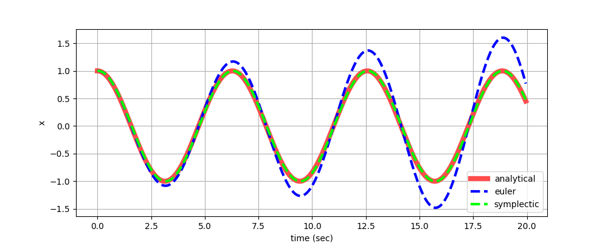
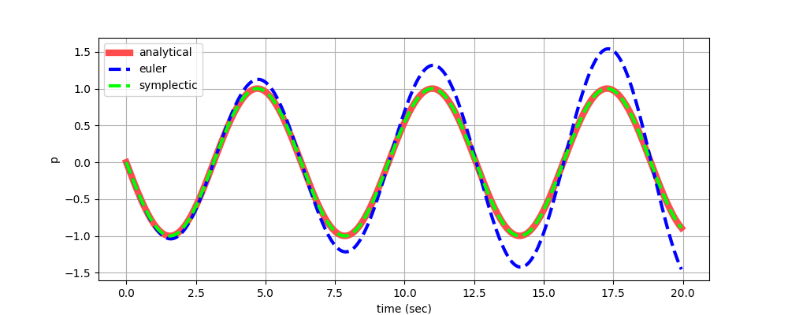
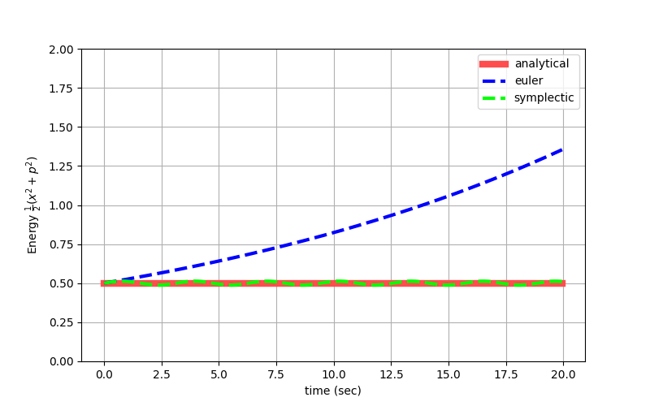
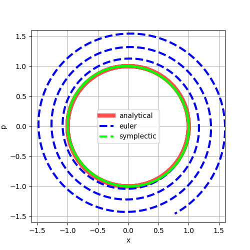

# symplectic_integrator
シンプレクティック数値積分法が体験できるコードです。シンプレクティック数値積分法については以下の記事をご覧ください。
https://zenn.dev/torataro/articles/2023-03-19-numerical_simulation

## コード概要
単振動のシミュレーションを実施します。このコードではシンプレクティック数値積分法の他にオイラー法と解析解と比較をします。こうした比較を通じてシンプレクティック数値積分法がオイラー法とは異なり長時間のシミュレーションに向いていること解析解に近い形でシミュレーションできることを体験できます。

## 実行方法
poetryやvenvで仮想環境を作成のち`poetry install`や`pip install -r requirements.txt`で必要なモジュールをインストールしてください。以下のコマンドで実行できます。
```
python .\main.py
```

## 実行結果例
時間ごとの位置の変化（赤：解析解、青：オイラー法、緑：シンプレクティック数値積分法）<br/>
<br/>
時間ごとの運動量の変化（赤：解析解、青：オイラー法、緑：シンプレクティック数値積分法）<br/>
<br/>
時間ごとのエネルギーの変化（赤：解析解、青：オイラー法、緑：シンプレクティック数値積分法）<br/>
<br/>
相空間での軌跡（赤：解析解、青：オイラー法、緑：シンプレクティック数値積分法）<br/>

